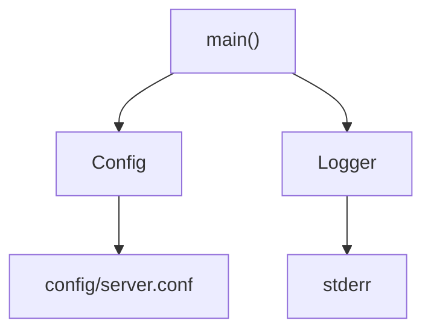
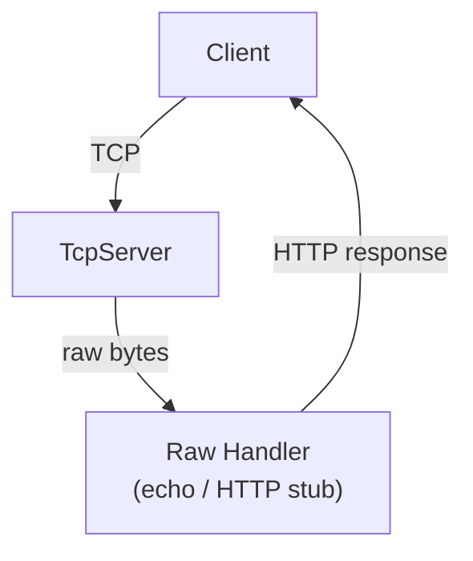
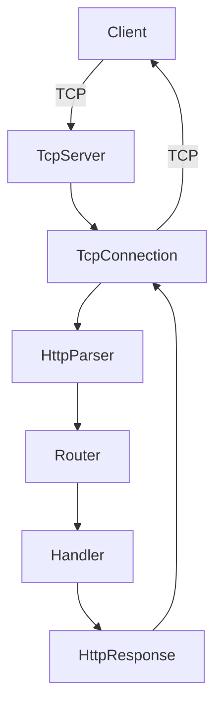
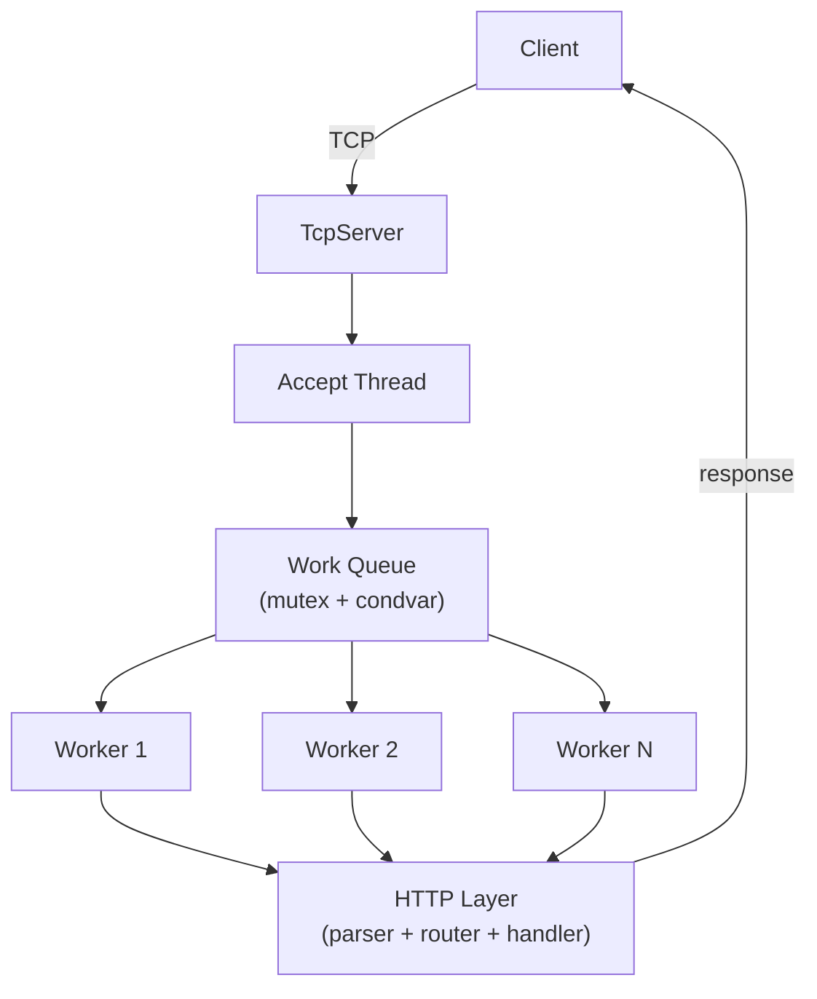
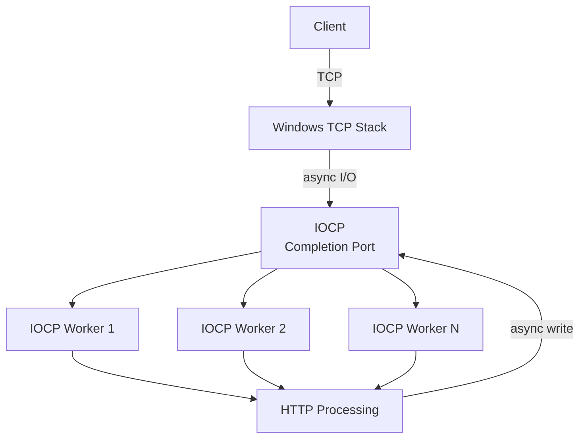
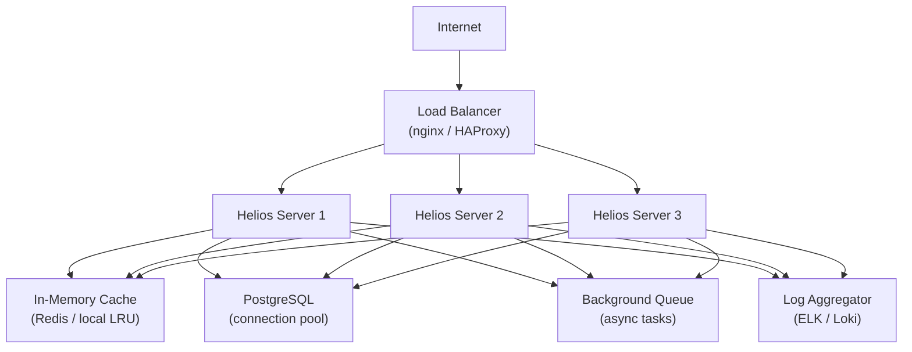
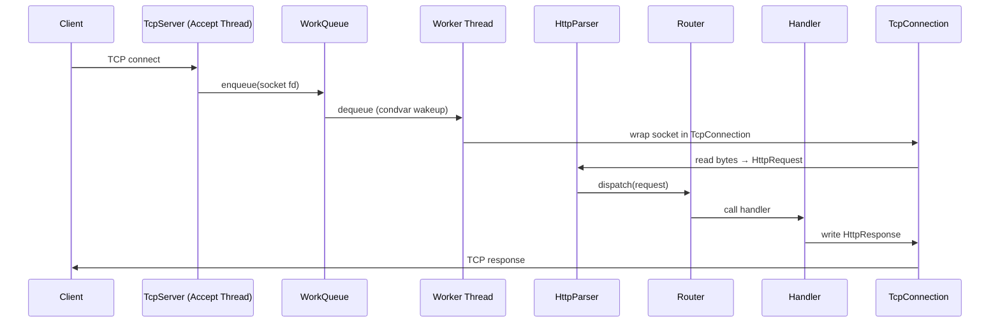
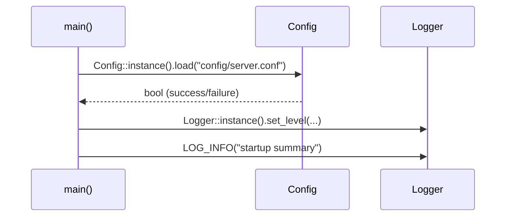
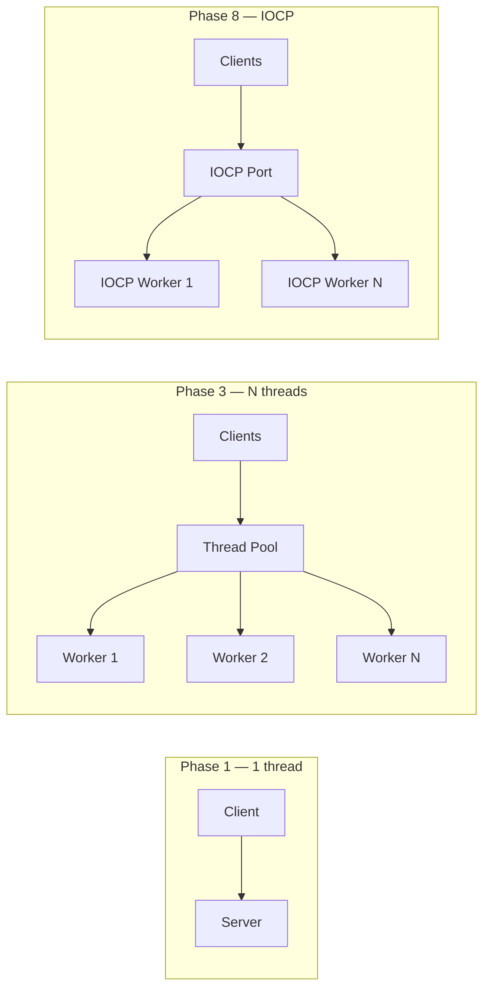
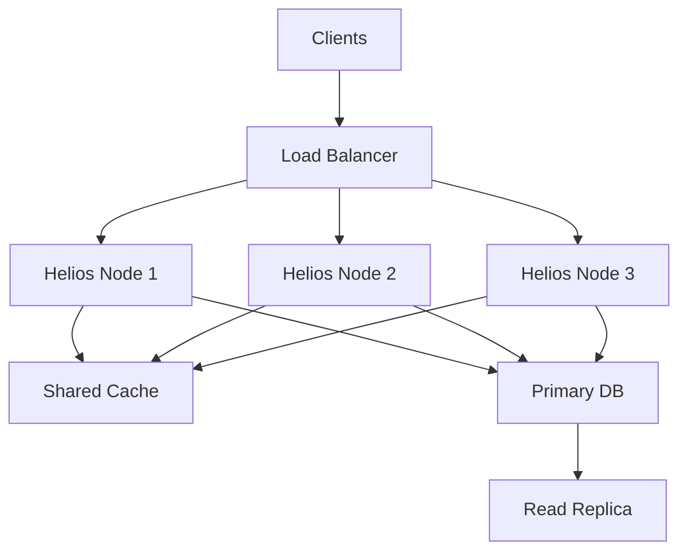

# Helios HTTP Server — High-Level Design (HLD)

> **Status:** Living document — updated at the end of each phase.  
> **Current phase:** 0 — Project Foundation  
> Sections marked **(Phase N)** will be filled in when that phase is implemented.

---

## Table of Contents

1. [System Goals](#1-system-goals)
2. [Functional Requirements](#2-functional-requirements)
3. [Non-Functional Requirements](#3-non-functional-requirements)
4. [Architecture Overview](#4-architecture-overview)
5. [Component Responsibilities](#5-component-responsibilities)
6. [Data Flow](#6-data-flow)
7. [Concurrency Model](#7-concurrency-model)
8. [Network Model](#8-network-model)
9. [Scaling Strategy](#9-scaling-strategy)
10. [Failure Scenarios](#10-failure-scenarios)
11. [Bottlenecks](#11-bottlenecks)
12. [Trade-offs](#12-trade-offs)
13. [Future Evolution](#13-future-evolution)

---

## 1. System Goals

Helios is a **production-oriented, multithreaded HTTP/1.1 server** built in C++17 on Windows.

It is designed to achieve two goals simultaneously:

| Goal | Description |
|------|-------------|
| **Educational** | Teach C++ systems programming, networking, concurrency, and production engineering phase-by-phase |
| **Production-ready** | Result in a server that handles real workloads with correctness, observability, and graceful failure modes |

### Non-goals (Phase 0)

- HTTP/2 or HTTP/3 support
- TLS/SSL (out of scope unless added as an optional phase)
- Full RFC 7230 compliance (we get progressively closer each phase)

---

## 2. Functional Requirements

| ID | Requirement | Phase |
|----|-------------|-------|
| FR-01 | Accept TCP connections on a configurable port | 1 |
| FR-02 | Parse HTTP/1.1 GET, POST, PUT, DELETE requests | 2 |
| FR-03 | Route requests to registered handlers | 2 |
| FR-04 | Return well-formed HTTP responses with status codes | 2 |
| FR-05 | Handle multiple concurrent connections | 3 |
| FR-06 | Support `GET /health`, `GET /users`, `POST /users` endpoints | 4 |
| FR-07 | Support HTTP Keep-Alive | 5 |
| FR-08 | Enforce request timeouts | 5 |
| FR-09 | Structured request/response logging | 6 |
| FR-10 | Expose request latency and throughput metrics | 6 |
| FR-11 | In-memory LRU cache with TTL | 9 |
| FR-12 | Database-backed user CRUD via PostgreSQL | 10 |
| FR-13 | Per-IP rate limiting | 11 |
| FR-14 | Input validation and request size limits | 12 |

---

## 3. Non-Functional Requirements

| ID | Requirement | Target |
|----|-------------|--------|
| NFR-01 | **Throughput** | ≥ 10,000 requests/sec on a 4-core machine (Phase 7 benchmark) |
| NFR-02 | **Latency** | P99 < 10ms for static responses without I/O (Phase 7) |
| NFR-03 | **Concurrency** | Handle ≥ 1,000 simultaneous connections |
| NFR-04 | **Correctness** | Zero data races (verified via MSVC thread sanitizer / Helgrind) |
| NFR-05 | **Graceful shutdown** | Drain in-flight requests; close sockets cleanly on SIGINT/SIGBREAK |
| NFR-06 | **Memory safety** | No raw owning pointers; RAII throughout |
| NFR-07 | **Observability** | Structured log lines parseable by common log aggregators |
| NFR-08 | **Portability** | Builds on MSVC and MinGW without code changes |

---

## 4. Architecture Overview

### Phase 0 — Foundation

### Phase 1 — Single-threaded TCP

### Phase 2 — HTTP Abstraction

### Phase 3 — Thread Pool

### Phase 8 — IOCP Architecture

### Phase 14 — Production Architecture

---

## 5. Component Responsibilities

| Component | Responsibility | Phase |
|-----------|---------------|-------|
| `Config` | Load and provide INI config values with defaults | 0 |
| `Logger` | Thread-safe structured logging with level filtering | 0 |
| `TcpServer` | Create socket, bind, listen, accept connections | 1 |
| `TcpConnection` | Own a single client socket; read/write bytes | 1 |
| `HttpParser` | Parse raw bytes into `HttpRequest` | 2 |
| `HttpRequest` | Immutable value object: method, path, headers, body | 2 |
| `HttpResponse` | Builder: status code, headers, body | 2 |
| `Router` | Match request path+method to handler functions | 2 |
| `ThreadPool` | Fixed-size pool of worker threads draining a task queue | 3 |
| `WorkQueue` | `std::queue` protected by `std::mutex + std::condition_variable` | 3 |
| `Middleware` | Pre/post-processing pipeline (logging, auth, rate limiting) | 4 |
| `Cache` | Thread-safe LRU cache with TTL | 9 |
| `DbPool` | PostgreSQL connection pool | 10 |
| `RateLimiter` | Per-IP token bucket | 11 |

---

## 6. Data Flow

### Request path (Phase 3+)

### Configuration load (Phase 0)

---

## 7. Concurrency Model

### Evolution across phases

| Phase | Model | Mechanism |
|-------|-------|-----------|
| 0 | Single-threaded | N/A |
| 1 | Single-threaded | N/A |
| 2 | Single-threaded | N/A |
| 3 | Thread pool | `std::thread`, `std::mutex`, `std::condition_variable` |
| 8 | IOCP + thread pool | Windows `CreateIoCompletionPort`, overlapped I/O |

### Shared state inventory (Phase 3+)

| State | Owner | Protection |
|-------|-------|-----------|
| `WorkQueue` | `ThreadPool` | `std::mutex` + `std::condition_variable` |
| `Logger` | Global singleton | `std::mutex` |
| `Config` | Global singleton | `std::mutex` (read-only after init) |
| Route table | `Router` | `std::shared_mutex` (readers concurrent) |
| Cache entries | `Cache` | `std::shared_mutex` (readers concurrent, writers exclusive) |
| Active connections count | `TcpServer` | `std::atomic<int>` |

### Fundamental concurrency rules for this project

1. **Identify every piece of shared mutable state** before writing a single line of concurrent code.
2. **Protect with the least invasive mechanism**: prefer `std::atomic` over mutex where appropriate.
3. **Never hold a lock while doing I/O** — this is a classic deadlock source.
4. **Use RAII lock guards** (`std::lock_guard`, `std::unique_lock`) — never unlock manually.
5. **Document every lock acquisition site** with a comment naming the invariant being protected.

---

## 8. Network Model

### Evolution across phases

| Phase | Model | API | Blocking? |
|-------|-------|-----|-----------|
| 1 | Single-threaded blocking | Winsock `recv`/`send` | Yes |
| 3 | Thread-per-connection (briefly) | Winsock | Yes (per thread) |
| 3+ | Thread pool + blocking socket | Winsock | Yes (per worker) |
| 8 | Async IOCP | `WSARecv`/`WSASend` overlapped | No |

### Why blocking sockets first?

Blocking sockets are conceptually simple: one thread, one connection, straightforward read-process-respond loop. They help you understand HTTP before introducing the complexity of async I/O. The performance ceiling is real but educational.

### Why IOCP eventually?

`select()` scales to ~1,024 fds on Windows and adds O(n) overhead. IOCP uses kernel completion queues — threads wake only when I/O is truly complete. This is how production-grade Windows servers (IIS, nginx-for-Windows) work.

---

## 9. Scaling Strategy

### Vertical scaling (single machine)

### Horizontal scaling (Phase 13+)

**Key requirements for horizontal scaling:**
- **Stateless servers** — session data must live in the cache/DB, not server memory.
- **Health checks** — load balancer polls `GET /health` to remove dead nodes.
- **Consistent hashing** (if cache is sharded) — minimise cache misses on scale-out.

---

## 10. Failure Scenarios

| Scenario | Detection | Recovery | Phase |
|----------|-----------|----------|-------|
| Client disconnects mid-request | `recv()` returns 0 or error | Close socket; log WARN | 1 |
| Malformed HTTP request | Parser returns error | Reply 400; close | 2 |
| Handler throws exception | `try/catch` in worker | Reply 500; log ERROR | 3 |
| Worker thread crashes | Thread join fails / `std::terminate` | TBD Phase 3 | 3 |
| Out of memory | `new` throws `std::bad_alloc` | Log FATAL; graceful exit | 3 |
| `accept()` returns error | Errno check | Log ERROR; retry with back-off | 1 |
| Config file missing | `load()` returns false | Use defaults; log WARN | 0 |
| Database connection lost | Connection health check | Re-connect from pool | 10 |
| Cache full | LRU eviction | Evict LRU entry; continue | 9 |
| Rate limit exceeded | RateLimiter.check() | Reply 429 Too Many Requests | 11 |

---

## 11. Bottlenecks

| Bottleneck | Phase discovered | Mitigation |
|------------|-----------------|------------|
| Single-threaded accept loop | 1 | Thread pool in Phase 3 |
| Blocking I/O per thread | 3 | IOCP in Phase 8 |
| Logger mutex contention | 6 | Lock-free ring buffer + writer thread (Phase 6) |
| Route table linear scan | 2 | Trie or hash map in Phase 4 |
| Database connection per request | 10 | Connection pool in Phase 10 |
| Cache lock under high read load | 9 | `std::shared_mutex` (read-many-write-few) |

---

## 12. Trade-offs

| Decision | Gain | Cost |
|----------|------|------|
| C++17, no framework | Full control, deep learning | More code to write |
| Header-only Logger | Zero build complexity | All code visible in headers; rebuild on changes |
| INI config (not JSON/TOML) | No external deps | Less expressive than structured formats |
| Static library for core | Clean test linkage | Slightly larger binary |
| Blocking sockets first | Simpler mental model | Single thread cannot handle concurrent conns |
| IOCP in later phase | Maximum throughput on Windows | Windows-only; complex API |
| Hand-rolled test harness | No deps | Less expressive than GoogleTest |
| Thread pool over thread-per-conn | Better resource control | Queue management complexity |

---

## 13. Future Evolution

| Phase | Capability added |
|-------|-----------------|
| 0 | Project foundation, logging, config |
| 1 | Single-threaded TCP + basic HTTP response |
| 2 | HTTP parsing, routing, proper request/response objects |
| 3 | Thread pool, concurrent connections |
| 4 | Full routing, middleware, application layer |
| 5 | Keep-Alive, timeouts, connection limits |
| 6 | Structured logging, metrics, observability |
| 7 | Benchmarking, performance tuning |
| 8 | IOCP — asynchronous I/O |
| 9 | In-memory LRU cache with TTL |
| 10 | PostgreSQL integration, connection pooling |
| 11 | Rate limiting (token bucket) |
| 12 | Security: validation, size limits, timeout protection |
| 13 | Horizontal scaling, load balancing discussion |
| 14 | Production architecture review |

---

*Last updated: Phase 0 — 2026-09-24*
